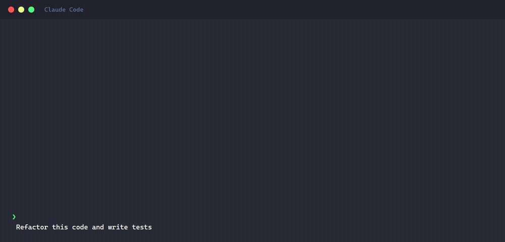

<div align="center">

# claude-cli-monitor

**Claude Code subagent monitoring.**

[](https://www.npmjs.com/package/claude-cli-monitor)
[](LICENSE)
[](https://nodejs.org/)


</div>

---




## What Is This

Tracks how many subagents spawn per session, what they do, and how many tokens they use.

- **Real-time statusline** — view directly in the statusline, no separate window needed.
- **One-command setup** — `claude-cli-monitor --init` registers hooks and config automatically.
- **No runtime dependencies** — no external packages.
- **Zero additional token cost** — pure local file I/O, no API calls.

## Quick Start

```bash
npm install -g claude-cli-monitor
claude-cli-monitor --init
```

`--init` registers the hooks and creates a config file. That's it. You can also run `npx claude-cli-monitor --init`.

After init, start Claude Code and the statusline appears automatically each session.

To remove hooks and config:

```bash
claude-cli-monitor --uninstall
```

## Configuration

```bash
claude-cli-monitor config          # Show current config
claude-cli-monitor config color    # Interactive color setup
```

| Setting | Default | Description |
|---------|---------|-------------|
| `colors.main` | `red` | Main session color |
| `colors.agents` | `orange` | Custom agent color |
| `colors.builtin` | `red` | Built-in agent color |
| `liveColor` | `bright-green` | LIVE indicator color |
| `rows` | `5` | Max visible statusline rows |
| `staleThresholdMs` | `900000` | Stale threshold (15 min) |

## How It Works

After setup, this table shows up at the bottom of your terminal:

```
⠋ Agents ──────────────────────────────────────────────────────────────────
│ Status       │ Agent      │ Model │ Task                        │ Used  │
├──────────────┼────────────┼───────┼─────────────────────────────┼───────┤
│ ◉ LIVE       │ built-in   │ Opus  │ find config files           │ ----  │
│ ◉ LIVE       │ reviewer   │ Snnt  │ code review task-001        │ ----  │
│ ✓ done(12s)  │ built-in   │ Snnt  │ design approach             │ ~12k  │
│ ✓ done(31s)  │ built-in   │ Haik  │ validate artifacts          │ ~8k   │
└──────────────┴────────────┴───────┴─────────────────────────────┴───────┘
```

| Column | Meaning |
|--------|---------|
| **Status** | `◉ LIVE` active / `✓ done(Ns)` completed / `⚠ stale` no update |
| **Agent** | `built-in` for generic types / custom agent name (e.g. `reviewer`) |
| **Model** | `Opus` / `Snnt` / `Haik` (shown when terminal width >= 120) |
| **Task** | Agent description or parsed task |
| **Used** | Token count. `----` = running (tokens show on completion) |

Three moving parts.

1. **Hooks** fire on agent lifecycle events. `SubagentStart`, `SubagentStop`, `PostToolUse`, `Stop`.
2. **State files** collect per-agent records. `~/.claude-cli-monitor/state/{sessionId}/`
3. **Statusline** reads them and draws the table.

## Limitations

- **Running agents** show `----` for tokens. Numbers appear when all tasks complete. ([anthropics/claude-code#43456](https://github.com/anthropics/claude-code/issues/43456))
- **Compacted sessions** — token data tracking may be affected.
- **Teammate/swarm** — different lifecycle, not tracked.
- **3+ depth agent chains** may show incomplete parent tracking.

## Requirements

- Node.js 18+
- Claude Code with hook support

## License

[MIT](LICENSE)
